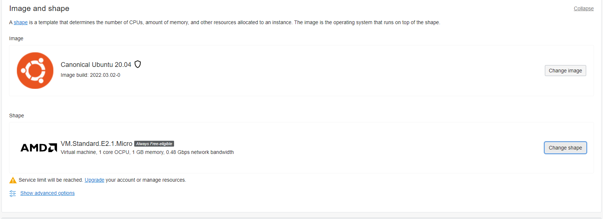

# CI configuration

All the non related infrastructure configuration is managed by the secrets explained [in the previous section](./secrets.md)
The following section contains the configuration needed on the python pipeline to create the infrastructure in the oracle cloud.

The configuration is stored [at the pipeline/config.py file.](https://github.com/datocal/nolocal/blob/master/pipeline/config.py)

## Compartment
The compartment will be the root of all the resources created for this application. 
The organization in the cloud infrastructure is divided into compartments to organize resources. 

It's created / deleted based on its name in the COMPARTMENT_NAME variable. 

Creating a custom compartment allows to isolate the application resources from the rest of the cloud resources we may be using in the account.

On creation/getting it from the existing ones by name, it will use an OCID like this:
    
    ocid1.compartment.oc1..aaaaaaaapmqwjhsyggcyrvqxytrpgsfsqsvsrnnrmpnxmhjukpykajvnjdjj 

## Virtual CLoud Network (VCN) 

The VCN will have all the network related infrastructure used by this application. It will be needed to configure a router table
with an Internet Gateway attached, a subnet and a security List.

### Security List
The SECURITY_LIST_RULES configuration allows us to configure the opened ports for the instance. We just need HTTP/HTTPS
and the provided SSH port.

    SECURITY_LIST_RULES = [
    {
        "port": 80,
        "description": "HTTP traffic for discord and monitoring connection to the bot"
    },
    {
        "port": 443,
        "description": "HTTPs traffic for discord and monitoring connection to the bot"
    }
]

## Instance 

The following configuration applies to the instance, the operating system and version will determine the image ocid used to 
create the instance.

    INSTANCE_OPERATING_SYSTEM = "Canonical Ubuntu"
    INSTANCE_OPERATING_SYSTEM_VERSION = "20.04"
    INSTANCE_SHAPE = "VM.Standard.E2.1.Micro"

### Image identifier
The identifier of the image depends on the image, build and region.

The full list of OCIDs for images [are listed here](https://docs.oracle.com/en-us/iaas/images/)
It's needed to enter on the _Read more_ section to see the OCIDs for each region

To get it, the most recent not aarch64 image is selected matching the operating system and version configured for the actual region.

## Instance shape

This is the shape of the compute instance created. It's a template that will determine the number of CPUs, amount of memory
and other resources allocated.

While creating an instance on the web console, it's the name displayed for the selected shape, for example:

    VM.Standard.E2.1.Micro

