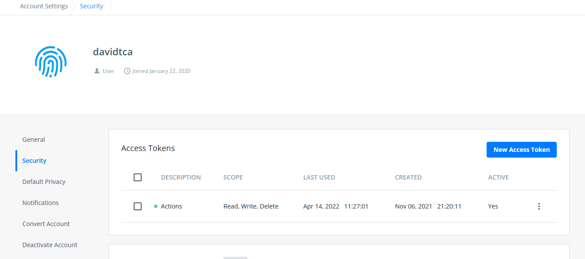

# Secrets
Multiple secrets are used in the project. Most of them used during CI processes. But some other for the application.

The secrets are managed by Github Secrets.

### DOCKERHUB_TOKEN

Token used to upload to [the docker hub](https://hub.docker.com/u/davidtca) the produced artifacts. 
 * [The jar application](./jobs.md#PrepareImage) 
 * [The custom caddy build](./jobs.md#SetUpCaddy)

It looks like an uuid
    
    97963003-29b6-4484-9dae-6a9c7beda9df

Another token can be generated at the dockerhub settings

### DUCKDNS_TOKEN

The token is used to link the current machine IP to the Duckdns domain. 
Useful to automate the recreation of the instance. 
It's used on the [PrepareOracleCLoud job](./jobs#PrepareOracleCLoud) after the ip is obtained

It looks like an uuid

    97963003-29b6-4484-9dae-6a9c7beda9df

The token is one per user at the duckdns site. The domain is linked to this same GitHub account

### SNYK_TOKEN
This token serves to realise the analisis by the [Snyk Job](./jobs#Snyk). The report is uploaded to the snyk site

As stated in the documentation, [Gradle Kotlin DSL files are not supported by the Github integration](https://app.snyk.io/org/davidtourino/project/fe14ca39-27ff-4f12-b039-32402360d83b)
That's the reason the integration is made by the Snyk CLI in Github actions, which requires the token.

### GITHUB_TOKEN
This token is generated by Github so the workflow has access to publish in branches.

It's used to publish the documentation in the docs branch.

No need to generate a personal access token manually.

### OCI_FINGERPRINT

### OCI_KEY_FILE

### OCI_REGION

Region of the Oracle cloud to be deployed into.

### OCI_TENANCY

### OCI_USER_OCID

### VM_AVAILABILITY_DOMAIN

### VM_COMPARTMENT_OCID

### VM_CUSTOM_IMAGE_OCID

### VM_SHAPE

### VM_SSH_PRIVATE_KEY

### VM_SSH_PUB_KEY

### VM_SUBNET_OCID
